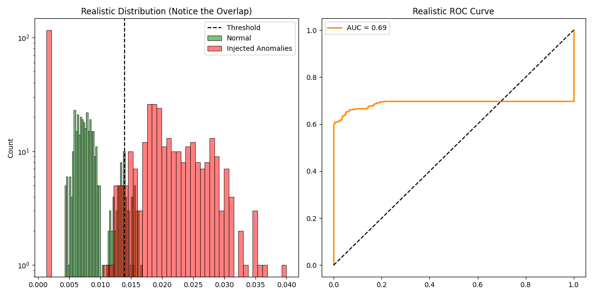

# AWS Cloud Anomaly Detection (DeepGuard)

**A Production-Grade MLOps System for Unsupervised Cloud Infrastructure Monitoring.**



## 1. Problem Statement & Business Value
**The Challenge:**
Modern cloud infrastructure generates millions of metric data points. Traditional static thresholds (e.g., "Alert if CPU > 80%") suffer from:
1.  **False Negatives:** Missing subtle failures like memory leaks that happen at low utilization.
2.  **False Positives:** Triggering alerts for normal, high-load spikes (Alert Fatigue).

**The Solution:**
DeepGuard utilizes an **Unsupervised LSTM Autoencoder** to learn the complex, temporal "normal" behavior of EC2 instances. It flags anomalies based on **reconstruction error**—if the model cannot reconstruct the input sequence, the behavior is anomalous.

## 2. Architecture
* **Model:** PyTorch LSTM Autoencoder (Encoder-Decoder architecture).
* **Data:** Numenta Anomaly Benchmark (AWS EC2 CPU Utilization).
* **API:** FastAPI (Async/Await) with Prometheus instrumentation.
* **Deployment:** Docker & Docker Compose.

## 3. Evaluation & Trade-offs
Since this is an unsupervised setting, we evaluate performance using **Reconstruction Error Distribution**.

### Threshold Selection (The Trade-off)
We use a dynamic threshold of **Mean + 2σ** (Standard Deviations) based on the validation set.
* **Lower Threshold:** Increases **Recall** (catches more anomalies) but risks higher False Positives (more noise).
* **Higher Threshold:** Increases **Precision** (alerts are more likely real) but risks False Negatives (missing real crashes).
* *Current setting (0.0128) prioritizes Precision to reduce pager fatigue for DevOps teams.*

### Classification Metrics (Proxy)
*Precision, Recall, and F1 scores are calculated in `evaluate.py` using statistical outliers (Top 5% quantile) as proxy ground-truth labels.*

## 4. Known Limitations
1.  **Unsupervised Nature:** The model is trained on "assumed normal" data. If the training data contains contamination (anomalies), the model may learn to accept them as normal.
2.  **Proxy Labels:** The classification metrics (F1/ROC) in the evaluation script are for **demonstration of the pipeline only**. Real-world performance requires labeled historical incidents for verification.
3.  **Static Threshold:** The production API currently uses a fixed threshold (`0.0128`) derived from initial training. A V2 improvement would load this threshold dynamically from the model artifact.

## 5. How to Run

### Local Evaluation
```bash
# 1. Install Dependencies
pip install -r requirements.txt

# 2. Train the Model
python src/main.py

# 3. Generate Evaluation Report
python src/evaluate.py